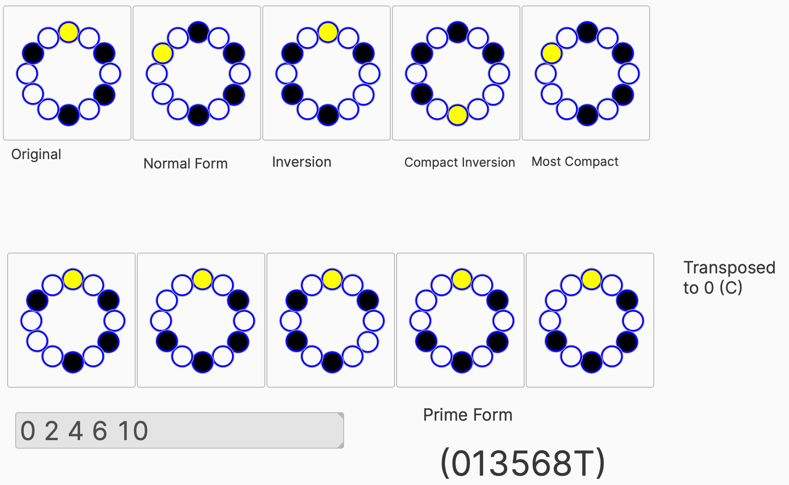

# MIDIsplainer
A repo for music-related code.
## MTILT (Music Technology: Inclusive Learning & Teaching)
My longterm (self-driven/-funded/-managed) project aims at inclusive learning through Music Technology. The learning experiences involved are meant to be varied and open-ended. So, #MTILT (Music Technology: Inclusive Learning & Teaching).
## “Commit changes…”
As GH says, even a simple action like editing a file is about “committing changes”. While I’m not a coder, I’ll be using this repo to share bits and pieces which can have an impact on ways other people do certain things.
## Initial Commit: Patching through Plugdata
[Plugdata](https://plugdata.org) is a version of [Puredata](http://puredata.info) (Pd), a visual programming system for music, sound, and multimedia. More specifically, Plugdata runs Pd patches either in standalone or in a plugin (VST3, Audio Unit, CLAP, LV2…). As of version 0.8.3 (released in January 2024?), Plugdata even runs as an AUv3 on iPadOS and iOS.



The very first patch I’m sharing, ```pcs2prime.pd```, is both very specialized and an appropriate “proof of concept” for several of my #MTILT projects. It takes a list of notes as a “Pitch Class Set” and outputs different versions, including the “Prime Form” and some circular visualization, related to the “visual method” [described](https://viva.pressbooks.pub/openmusictheory/chapter/pc-sets-normal-order-and-transformations/) by Megan Lavengood in _Open Music Theory_. In Pd parlance, the `pcscircle.pd` file is an “abstraction” which is required for the `pcs2prime.pd` patch to run properly. (Both files should be in the same folder.)
## “This is all so nerdy/geeky/dorky/complicated!”
This is likely all very obscure, at this point, and requires specialized knowledge. 

> Where’s the inclusion?

In a process, which is barely starting.
I find it important to share early and frequently.
